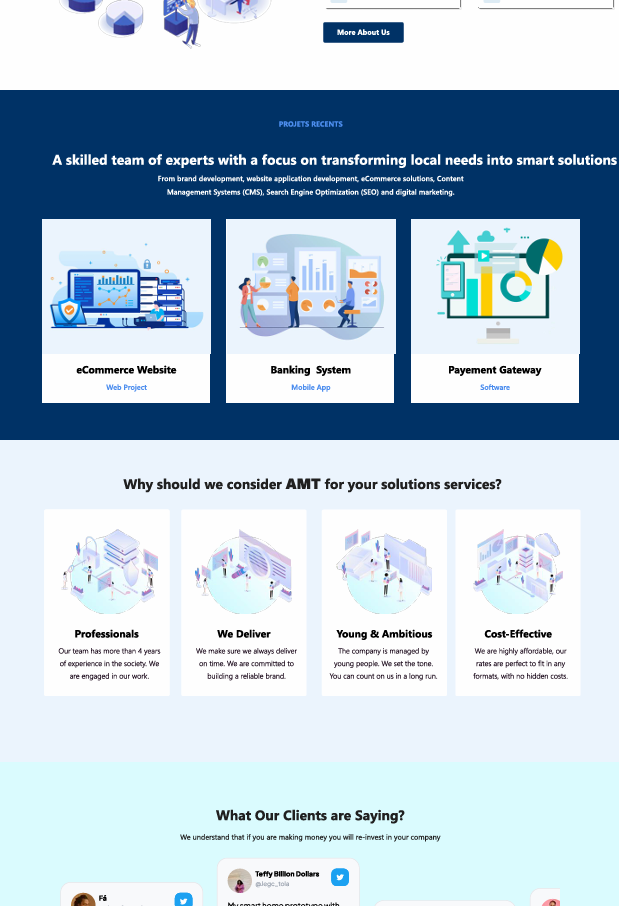
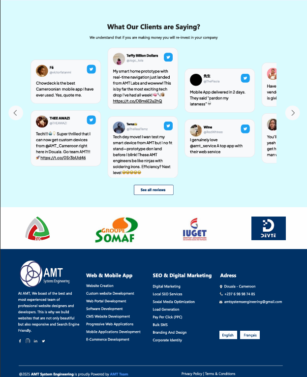

# 🌐 AMT Systems Engineering – Site Web Officiel

Bienvenue dans le dépôt du site web officiel de **AMT Systems Engineering**, une entreprise spécialisée dans l'ingénierie des systèmes, les solutions technologiques et les services innovants pour les secteurs industriels et technologiques.

---

## 🧭 À propos

Ce projet a pour but de développer un site vitrine moderne, responsive et professionnel pour AMT Systems Engineering. Il présente l’entreprise, ses services, ses projets et permet de faciliter la prise de contact avec les clients et partenaires.

---

## 📁 Structure du site

Le site web comprend les sections suivantes :

- 🏠 **Accueil**
- 🧑‍💼 **À propos de nous**
- 🛠️ **Nos services**
- 🏗️ **Nos projets / Réalisations**
- 👥 **Notre équipe**
- 📩 **Contact**

---

## 🛠️ Technologies utilisées

- HTML5 / CSS3 / JavaScript
- [Framework à préciser] (exReact)
- [Library] Materia UI
- [API messagerie]  Formspree pour les formulaires de contact


---
## 🖼️ Maquette du site

Voici quelques captures de la maquette de notre site web  :

<p align="center">
  
  
</p>
<p align="center">
  
</p>

---
## 🚀 Lancer le projet en local

```bash
# Clone du dépôt
git clone https://github.com/ton-utilisateur/amt-systems-website.git

# Aller dans le dossier du projet
cd amt-systems-website

# Installer les dépendances (si applicable)
npm install

# Lancer le serveur de développement
npm run dev
